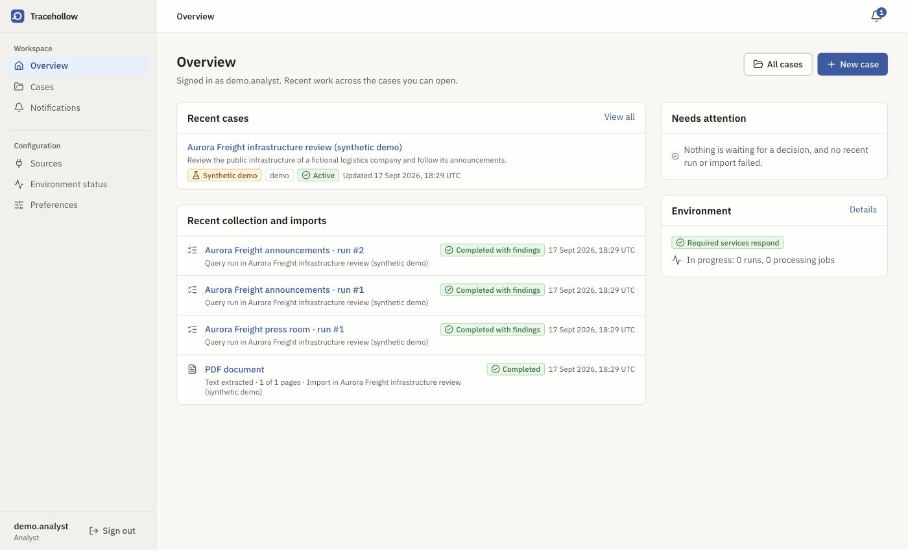
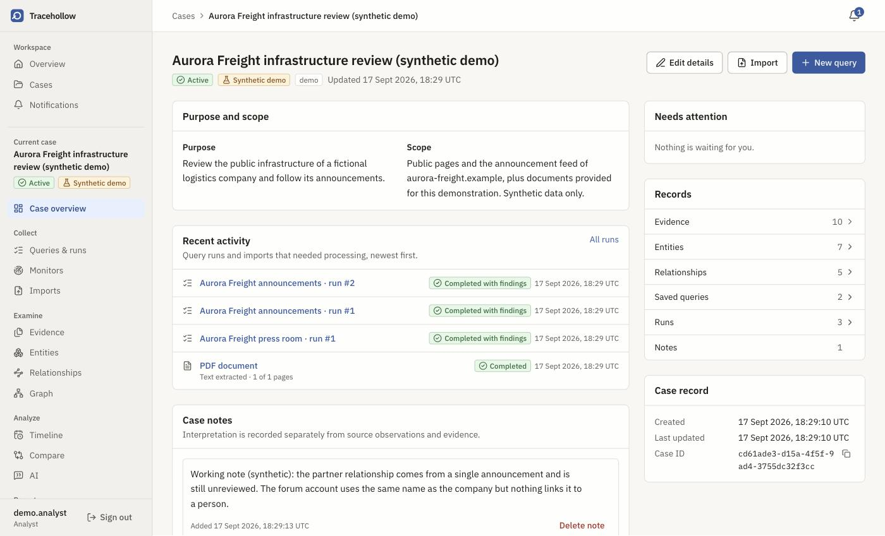
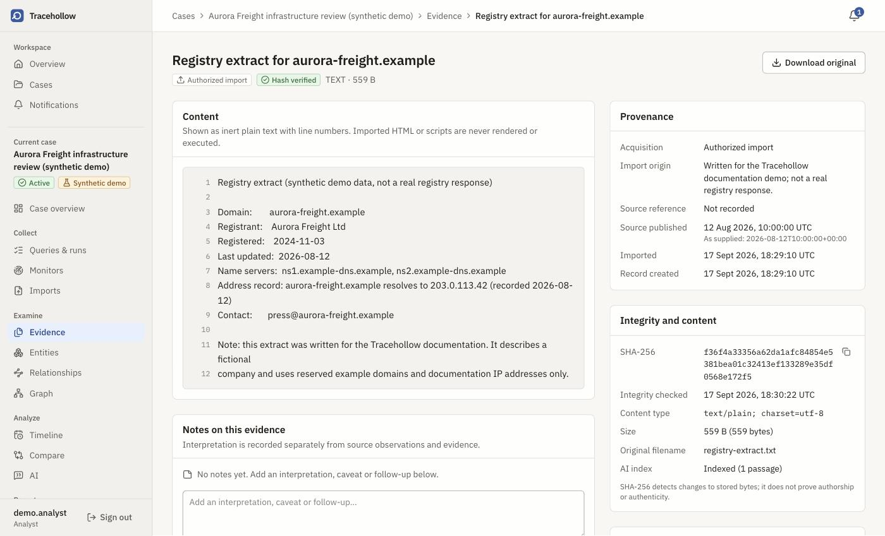
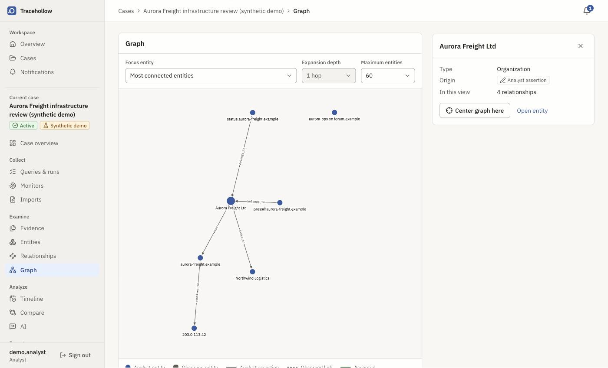
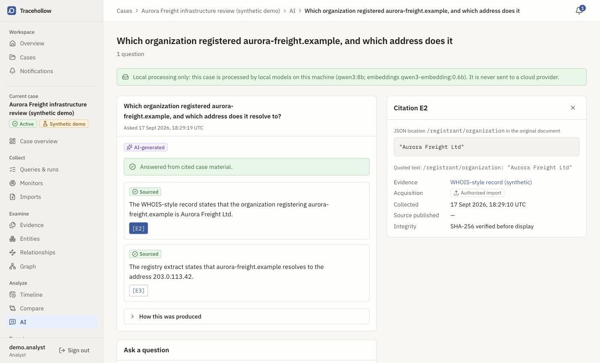
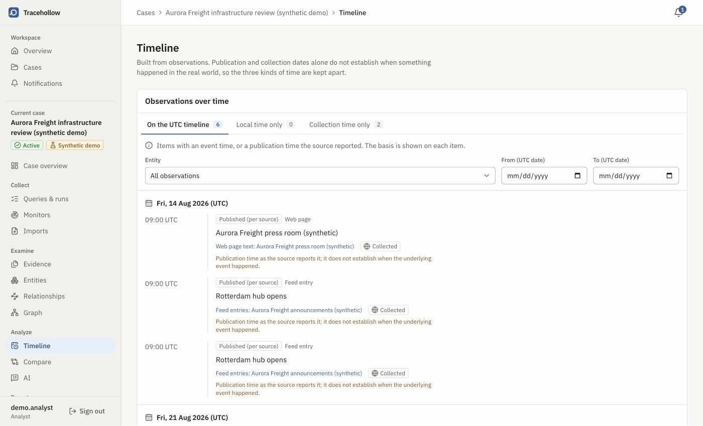
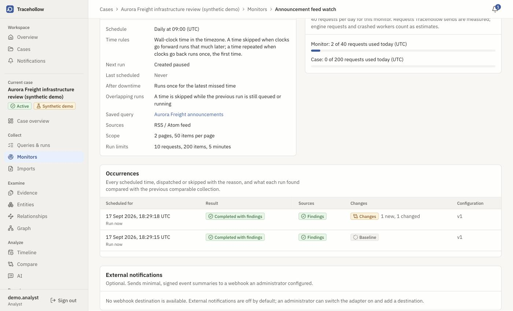
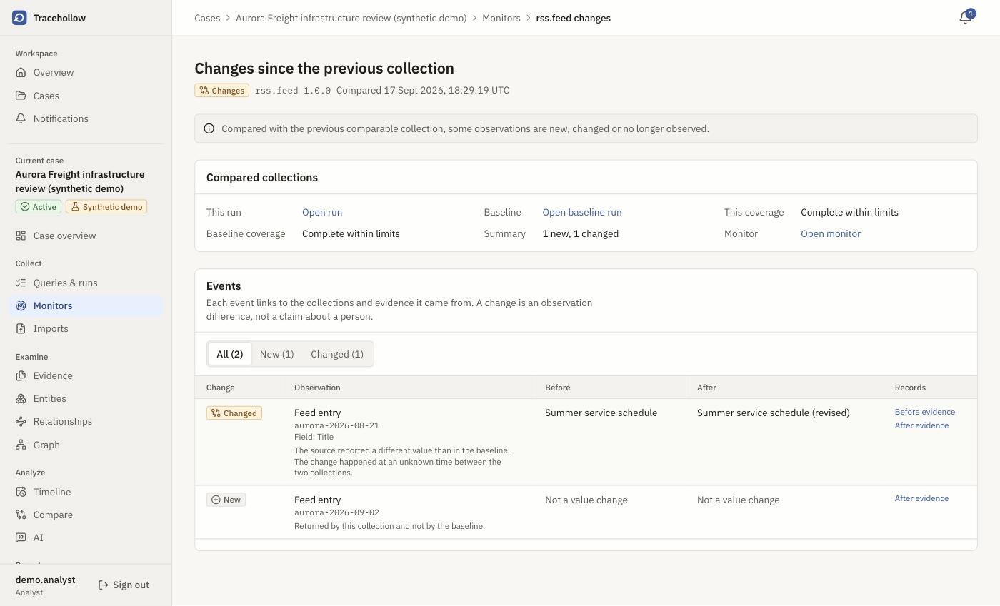
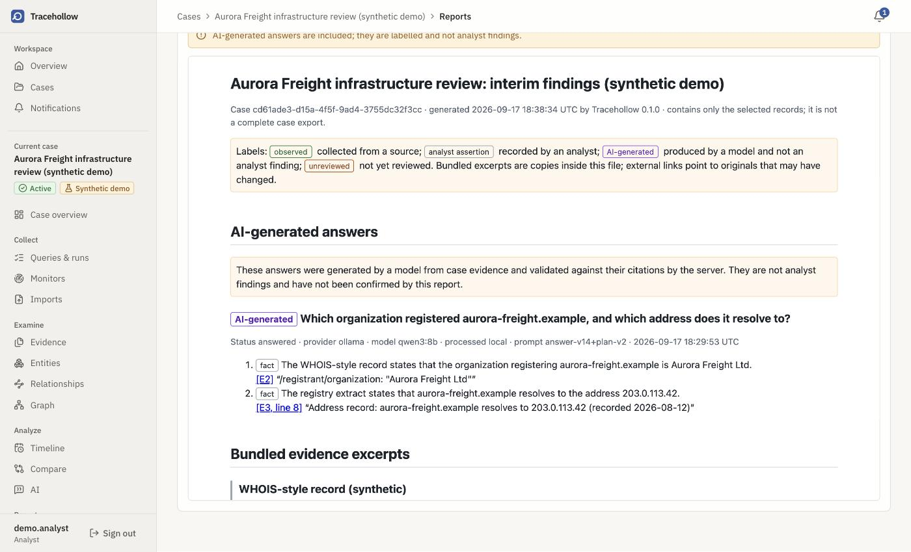

<div align="center">


# Tracehollow

**A self-hosted OSINT workspace that keeps every finding attached to its evidence.**

Cases, evidence with provenance, collection from public sources, and answers from a local model
that cite the exact passage they came from. It runs on your own machine with Docker Compose.
No account, no API key, nothing leaves the host unless you ask it to.

[](docs/releases/v0.1.0-rc.1.md)
[](LICENSE)
[](docs/STATUS.md)
[](docs/testing/performance.md)
[](#quick-start)

<br>


<br>



<sub>Every screenshot on this page shows a synthetic demonstration case about a fictional company.
No real person, account or investigation appears in them.</sub>

</div>

---

## What it does

Tracehollow is built for work that has to hold up after the fact. Evidence is stored with the
origin you recorded, its SHA-256 and its collection dates, shown as inert text, and downloaded
only after the hash is checked again. Collection runs report what actually happened per source:
findings, nothing found, partial coverage, rate limited, authentication required, access denied or
a failure. An empty result is never quietly turned into an absence.

It collects from public web pages, RSS and Atom feeds, GitHub accounts, 58 platforms for username
discovery, and passive subdomain data through a network sandbox. It imports the material you
already hold: WhatsApp chat exports and PDF documents, processed by a worker that has no route to
the internet at all.

The optional AI runs against a local model. Answers are split into labelled claims, each citing a
passage in a hash-verified record; a claim whose citation does not support it is removed before you
ever see it. Exact counts come from read-only database tools rather than from the model. A case can
be marked local-only, and then nothing in it can reach a cloud provider.

When a source needs watching, a monitor reruns a saved query on a schedule, inside a budget, and
reports what changed against the last complete comparable collection. Teams get administrator,
analyst and viewer roles with per-case membership, an audit trail, and retention that needs a
preview and a typed confirmation.

## The investigation, screen by screen

<table>
<tr>
<td align="center" width="50%"><br><b>The case</b><br><sub>Purpose and scope, what has been<br>collected, what needs a decision</sub></td>
<td align="center" width="50%"><br><b>The evidence</b><br><sub>How it was acquired, when it was<br>published, and its hash</sub></td>
</tr>
<tr>
<td align="center"><br><b>The relationships</b><br><sub>Bounded, and always explicit about<br>where each link came from</sub></td>
<td align="center"><br><b>The answer</b><br><sub>Produced locally, every claim citing<br>a location in a verified record</sub></td>
</tr>
<tr>
<td align="center"><br><b>The timeline</b><br><sub>Publication, local and collection time<br>kept apart, never merged</sub></td>
<td align="center"><br><b>The monitor</b><br><sub>Scheduled, budgeted, paused until<br>somebody confirms it</sub></td>
</tr>
<tr>
<td align="center"><br><b>The change</b><br><sub>Before and after, linked to the<br>evidence on both sides</sub></td>
<td align="center"><br><b>The report</b><br><sub>Only what you selected, with citations<br>that still resolve offline</sub></td>
</tr>
</table>

## Quick start

You need Docker Engine or Docker Desktop with Compose v2, `bash`, and `openssl` or `/dev/urandom`.
Nothing else: no paid API, no cloud account, no language model.

```bash
git clone https://github.com/sayginsaman/Tracehollow.git
cd Tracehollow

# Create .env and generate local secrets under secrets/. Safe to re-run; it never overwrites.
scripts/setup.sh

# Build the images and start the core services, waiting until they report healthy.
docker compose up --build --detach --wait

# Print the one-time setup token.
cat secrets/bootstrap_token
```

Open <http://localhost:3000>, paste the token on **Create the administrator**, and choose a
username and a password of at least 12 characters. This repository ships no account and no example
credential you could reuse.

Services bind to `127.0.0.1` by default. `docker compose down` and `docker compose up --detach`
keep your data; the named volumes hold the database, the broker and the evidence files.

New here? [Install and run your first investigation](docs/guides/first-investigation.md) walks from
an empty machine to a finished report.

| Optional extra | What it adds | Guide |
| --- | --- | --- |
| Local AI | Evidence-grounded answers, summaries and relationship suggestions from a local Ollama model | [ai-models.md](docs/operations/ai-models.md) |
| OCR | Tesseract for scanned PDFs, built only with `TRACEHOLLOW_INSTALL_OCR=true` | [document-processing.md](docs/operations/document-processing.md) |
| Connector credentials | GitHub, Instagram Graph API, Telegram Bot API and YouTube Data API access | [connectors](docs/connectors/README.md) |

## What each capability can actually do

The difference between implemented and verified matters in this kind of tool, so it is written
down. "Fixture-tested" means checked against controlled fixtures and the running stack, not against
the live platform.

| Capability | State |
| --- | --- |
| Cases, evidence, entities, relationships, exports | Implemented, verified in the stack |
| Public web page, RSS/Atom feed, GitHub account | Live-verified once each on 2026-09-15, one authorized target per connector |
| Username discovery (Sherlock, 58 platforms) | Live-verified on 3 of 58 platforms; the rest fixture-tested |
| Passive subdomain discovery (Subfinder) | Fixture-tested; the live check was partial (one provider answered, one returned 403) |
| WhatsApp imports | For authorized exports you supply, tested with synthetic exports. **Not a way to read private conversations** |
| PDF text extraction, optional OCR | Implemented, fixture-tested; OCR is kept as a separate labelled record |
| Instagram | Graph API Business Discovery for professional accounts, plus an off-by-default public profile lookup. Fixture-tested. **No private-profile or unrestricted personal-account access** |
| Telegram | Public channel previews and Bot API chat metadata. Fixture-tested. **No user sessions, joining or messaging** |
| YouTube | Channel uploads and video comments through the Data API. Fixture-tested. **Transcripts are not available** |
| Evidence-grounded AI, local model | Implemented; evaluated on a versioned synthetic set of 41 questions with a frozen holdout |
| Cloud AI generation (opt-in per case) | Implemented against documentation and mocked responses. **Never called live** |
| Monitors, budgets, change detection, notifications | Implemented; verified against a controlled fixture source. No real source monitored, no real notification service contacted |
| Roles, case membership, audit trail, retention | Implemented, verified in the stack. The audit trail is transactional but **not tamper-evident** |
| STIX 2.1 subset | Implemented for export and bounded, idempotent import |
| MISP and OpenCTI | **Deferred**, not implemented |
| Continuous integration on a hosted runner | See [docs/STATUS.md](docs/STATUS.md) for the current, actual state |

## How it fits together

```
                      browser (127.0.0.1)
                              |
                    edge network
                  /                 \
             web (Next.js)      api (FastAPI)
                                     |
                              data network (internal, no internet route)
              +--------------+-------+--------+---------------+
              |              |                |               |
        postgres         redis          worker          dispatcher
     (cases, evidence   (broker    (imports, documents,   (outbox relay,
      index, outbox,     only)      retention, exports)    monitor slots)
      pgvector)
              |                                |
        evidence volume                   collector -----> collect-egress ----> public sources
                                               |
                                          discovery ----> discovery-gateway --> passive datasets
                                               |               (allowlist, verified TLS)
                                       discovery-runner
                                        (Subfinder, no direct route out)

        ai-worker ----> ai-egress ----> local Ollama (optional; cloud only if a case allows it)
```

PostgreSQL is authoritative: cases, evidence metadata, queries, runs, the outbox, monitor
schedules, budgets and the vector index all live there. Redis is only a broker. Evidence files sit
on their own volume and are never served as active content. `worker` and `dispatcher` have no
internet route; anything that reaches the network does so from `collector`, `discovery-runner`
(through its gateway) or `ai-worker`.

## Documentation

Start at the [documentation index](docs/README.md).

| If you want to | Read |
| --- | --- |
| Install and run your first investigation | [first-investigation.md](docs/guides/first-investigation.md) |
| Recreate the demo case from these screenshots | [demo-dataset.md](docs/guides/demo-dataset.md) |
| Set up the local model and grounded answers | [ai-models.md](docs/operations/ai-models.md) |
| Understand each source and its credentials | [connectors](docs/connectors/README.md) |
| Import WhatsApp exports and documents | [whatsapp.md](docs/imports/whatsapp.md), [document-processing.md](docs/operations/document-processing.md) |
| Run monitors, budgets and notifications | [monitoring](docs/monitoring/README.md) |
| Manage roles and case membership | [permissions.md](docs/security/permissions.md) |
| Produce reports and exchange STIX | [analysis](docs/analysis/README.md), [stix.md](docs/interoperability/stix.md) |
| Back up, restore, upgrade and retain | [backup-restore.md](docs/operations/backup-restore.md), [retention.md](docs/operations/retention.md) |
| Fix a stuck stack | [troubleshooting.md](docs/operations/troubleshooting.md) |
| Write a connector | [connectors.md](docs/development/connectors.md) |
| See what has been verified, and how | [STATUS.md](docs/STATUS.md), [performance.md](docs/testing/performance.md) |

Architecture decisions live in [docs/adr](docs/adr/README.md); the product specification is
[PRD.md](PRD.md).

## Development

```bash
cd services/api && uv run ruff check . && uv run ruff format --check . && uv run mypy
cd apps/web && pnpm lint && pnpm typecheck && pnpm test && pnpm build
scripts/test-backend.sh          # ephemeral PostgreSQL and Redis containers
make check                       # everything above
```

Stack-level acceptance scripts (`scripts/verify-phase0.sh` … `verify-phase5.sh`,
`scripts/verify-release.sh`) start isolated Compose projects with their own ports and volumes.
[CONTRIBUTING.md](CONTRIBUTING.md) covers the workflow, testing expectations and code style;
[docs/development/connectors.md](docs/development/connectors.md) covers adding a source.

## Security and limits

Report a vulnerability privately as described in [SECURITY.md](SECURITY.md). Please do not open a
public issue for one.

What Tracehollow will not do:

- Bypass authentication, rate limits, private-profile restrictions or a platform's terms.
  Capability-dependent access stays capability-dependent.
- Merge identities. The same username on two platforms is a lead, never a person.
- Treat an empty result as an absence.

What it has not been through: an independent security review, a screen-reader pass, a multi-tenant
or internet-exposed deployment, or text handling in languages other than Turkish and English.
Localhost deployment still requires authentication.

You are responsible for the legality of what you collect. Collect only material you are authorized
to collect.

## License

MIT, in [LICENSE](LICENSE). Third-party components keep their own licenses: the notices are in
[NOTICE.md](NOTICE.md) and the full inventory, including the copyleft components, is in
[docs/licensing/dependencies.md](docs/licensing/dependencies.md). No language model ships with
Tracehollow; any model you download carries its own license.
